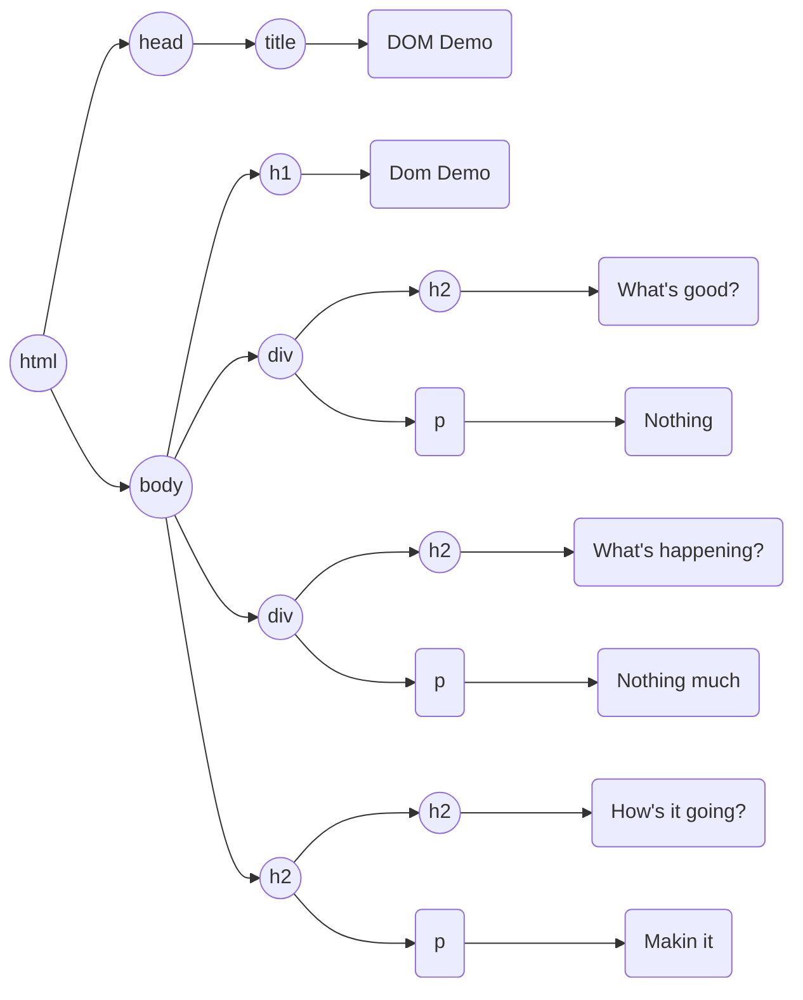
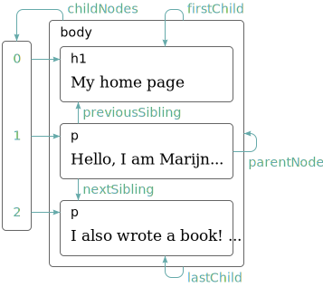

Visual Design and Web Project | Coding Sessions | Joseph Muller

[Previous](bugs-and-errors.md) | [All](README.md) | [Next]()
# How JavaScript reads a webpage

You may recall from last term that we can think of HTML documents as trees. This is a good habit because that is also how they are understood by web browsers. The browser-defined representation of the HTML document is called the Document Object Model, or the DOM.

The DOM contains every part of the HTML document, including all elements, their attribute names and values, and their text contents. You can also use it to fetch computed CSS properties.

Browsers in turn make the DOM available to JavaScript code. This lets you assign parts of the DOM to variables, run code that performs computations with the values of DOM objects, and modify those values, changing parts of the webpage in real time, without the browser having to reload the whole thing.

## The `document` object and its many children

If you run JavaScript code in the browser, you will have access to a global `document` binding. This binding points to a JavaScript object with dozens of properties and methods that point at or fetch different parts of the HTML tree.

Here is how you might chain properties together to move down a branch of the tree:

https://github.com/Birkbeck2/vdwp2223/blob/d7a2bb4f8e98b89a2916f0ff1bb423d61d50cb03/dom.html#L1-L22

https://github.com/Birkbeck2/vdwp2223/blob/d7a2bb4f8e98b89a2916f0ff1bb423d61d50cb03/dom.js#L1-L5

You can traverse the tree solely with properties (when the branch is an object) and index notation (when you get to a list).

https://github.com/Birkbeck2/vdwp2223/blob/d7a2bb4f8e98b89a2916f0ff1bb423d61d50cb03/dom.js#L11-L15

In this example, most parts of the path are objects, so you can use properties like `lastChild` to access them. But `children` is an array-like object, so you have to specify which way to go with an index.

The DOM offers a variety of properties like this.

*Diagram from Marijn Haverbeke, *Eloquent JavaScript*, ch. 14. Licensed under [CC BY-NC 3.0](https://creativecommons.org/licenses/by-nc/3.0/).*

One last thing: notice that the script is imported at the bottom of the HTML `body`.

https://github.com/Birkbeck2/vdwp2223/blob/d7a2bb4f8e98b89a2916f0ff1bb423d61d50cb03/dom.html#L19-L22

This is so that the elements load into the DOM before the script runs and tries to find things on the DOM. If we put this script in the `head`, `whatsHappening` above would log as `undefined`.

## DOM methods for querying

In most cases, you won't want to use properties alone. Most HTML documents are deeply nested, meaning you have to write a very long property chain. Property chains could also broken if you change part of the document structure.

So, the DOM also has query methods for getting elements by tag name, by id, and by class.

https://github.com/Birkbeck2/vdwp2223/blob/d7a2bb4f8e98b89a2916f0ff1bb423d61d50cb03/dom.js#L21-L35

Notice that two of these methods return sets of elements, while one (`getElementById`) returns a single object representing an element. The sets are represented by `HTMLCollection` objects, which share some properties of arrays. They have a length, and they can be iterated over or picked through with indexes like `0` or `2`. 

https://github.com/Birkbeck2/vdwp2223/blob/d7a2bb4f8e98b89a2916f0ff1bb423d61d50cb03/dom.js#L35-L44

When you access any of the objects in sets, it's the same type of object returned by `getElementById`. When you log it, it looks like an HTML string (`<h2 id="q1" class="question greeting">`), but it's actually an `Element` object with special properties for accessing attributes and inner contents of the element.

https://github.com/Birkbeck2/vdwp2223/blob/d7a2bb4f8e98b89a2916f0ff1bb423d61d50cb03/dom.js#L47-L61

In addition to these properties that map to corresponding HTML attributes, you have the generic method `getAttribute` to get any attribute.

https://github.com/Birkbeck2/vdwp2223/blob/d7a2bb4f8e98b89a2916f0ff1bb423d61d50cb03/dom.js#L64-L71

Note that these methods will get live objects. The values bound to these variables will change if the related DOM elements change. More on that in the next segment, when we start using JavaScript to change the DOM.

## Querying with CSS selector syntax

Perhaps the most convenient query methods are `querySelector` and `querySelectorAll`, because they take arguments that mimic CSS selectors for tag names, ids, and classes.

https://github.com/Birkbeck2/vdwp2223/blob/d7a2bb4f8e98b89a2916f0ff1bb423d61d50cb03/dom.js#L75-L83

Note that like the `getElementBy...` query methods, you can either get a set of elements as a `NodeList` object or a single element as a `Node` object, depending on the query method.

`NodeList` shares some of the properties of arrays, so you can iterate over it or access items by their index.

https://github.com/Birkbeck2/vdwp2223/blob/d7a2bb4f8e98b89a2916f0ff1bb423d61d50cb03/dom.js#L88-L95

And `Node` has many of the same properties of `Element`.

https://github.com/Birkbeck2/vdwp2223/blob/d7a2bb4f8e98b89a2916f0ff1bb423d61d50cb03/dom.js#L100-L103

However, there is an important difference. When you use `querySelector` and `querySelectorAll`, the resulting objects will not be live. They will not update when the DOM objects they were created from are updated. More on the significance of this in the next segment.

## Querying a subsection of the DOM

It's worth noting that most of the ancestors of `document` have the same methods that it does. So if you want to run queries on just one branch of the tree to limit the scope, you can.

https://github.com/Birkbeck2/vdwp2223/blob/d7a2bb4f8e98b89a2916f0ff1bb423d61d50cb03/dom.js#L108-L111

## References
Marijn Haverbeke, *Eloquent JavaScript: A Modern Introduction to Programming* (EJS), third edition, 2018, [https://eloquentjavascript.net/](https://eloquentjavascript.net/)

“HTMLCollection,” Mozilla Developer Network, [https://developer.mozilla.org/en-US/docs/Web/API/HTMLCollection](https://developer.mozilla.org/en-US/docs/Web/API/HTMLCollection).

“NodeList,” Mozilla Developer Network, [https://developer.mozilla.org/en-US/docs/Web/API/NodeList](https://developer.mozilla.org/en-US/docs/Web/API/NodeList).

## Rights
Copyright Birkbeck, University of London

 This work is licensed under a <a rel="license" href="http://creativecommons.org/licenses/by/4.0/">Creative Commons Attribution 4.0 International License</a>.
