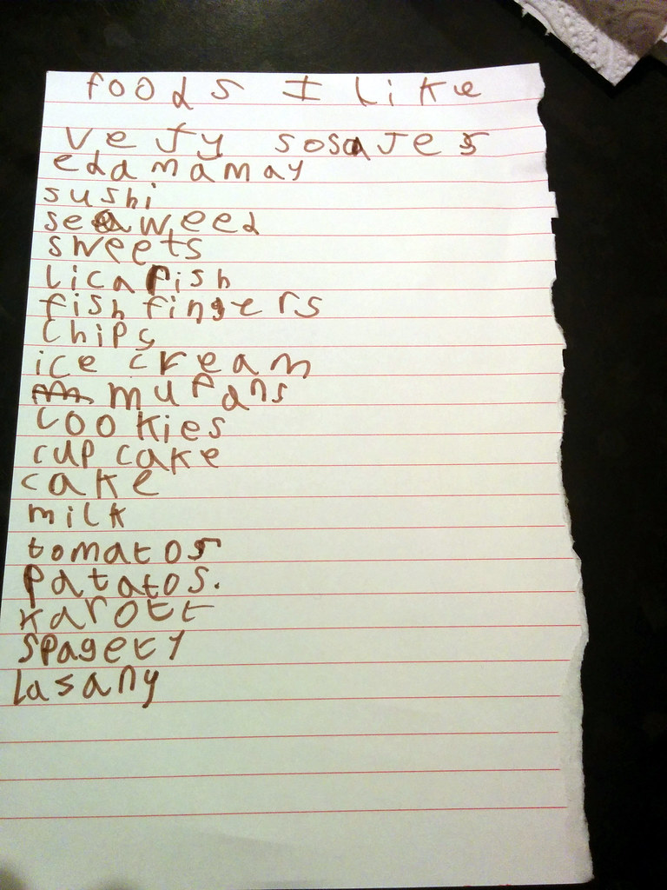

Visual Design and Web Project | Coding Sessions | Joseph Muller

[Previous](writing-functions-to-make-programs-modular.md) | [All](README.md) | [Next](working-with-strings.md)
# Forming data sets with arrays

*"Foods I Like, Poesy's list, the flat, Hackney, London, UK" by gruntzooki is licensed under CC BY-SA 2.0. To view a copy of this license, visit [https://creativecommons.org/licenses/by-sa/2.0/?ref=openverse](https://creativecommons.org/licenses/by-sa/2.0/?ref=openverse).*

The world is full of lists, and so are computer programs.

In JavaScript, lists are called *arrays*. With arrays, you can collect things into larger groups, add things to groups, remove things, and create subgroups. You can also prepare things for iteration, and catch the outputs of iteration--which we will talk about next.

## Array rules

Arrays are formed with square brackets at the beginning and end, and commas are used to separate items.

They can be bound to variables, as in this example:

https://github.com/Birkbeck2/vdwp2223/blob/6b85fd3cbe4876058dae9ec57417273de5fe5ec0/forming-data-sets-with-arrays.js#L1-L4

Arrays can hold all types of data, including strings, numbers, booleans, empty items, and even other arrays.

https://github.com/Birkbeck2/vdwp2223/blob/6b85fd3cbe4876058dae9ec57417273de5fe5ec0/forming-data-sets-with-arrays.js#L7-L11

## Indexing

Arrays keep track of the order of their items by giving each one a number, which is called its *index*.

This is very helpful when programming, but you have to remember that the numbering starts from `0`, not `1`. Starting at `0` is typical of most programming languages. It's tricky at the beginning, but you will get used to it.

https://github.com/Birkbeck2/vdwp2223/blob/6b85fd3cbe4876058dae9ec57417273de5fe5ec0/forming-data-sets-with-arrays.js#L14-L15

To access the value by its index, you can put the index inside square brackets after the array or the variable to which it is bound:

https://github.com/Birkbeck2/vdwp2223/blob/6b85fd3cbe4876058dae9ec57417273de5fe5ec0/forming-data-sets-with-arrays.js#L18-L30

## Slicing

Indexes let you get one item, but what if you need multiple items? A subset of the array?

You can use the `slice` method to get part of an array as a new array.

(By the way, a *method* is a function that you can call on any object of a certain type, after a dot, like `log` in `console.log()`. More on methods soon.)

The `slice` method takes two parameters, the index to start with and the index to go up to. The first number is inclusive, the second is exclusive.

https://github.com/Birkbeck2/vdwp2223/blob/6b85fd3cbe4876058dae9ec57417273de5fe5ec0/forming-data-sets-with-arrays.js#L33-L39

If you leave the second index out, the slice will go to the end of the array.

https://github.com/Birkbeck2/vdwp2223/blob/6b85fd3cbe4876058dae9ec57417273de5fe5ec0/forming-data-sets-with-arrays.js#L42-L44

## Combining

You can combine or *concatenate* multiple arrays into one array with the `concat` method.

https://github.com/Birkbeck2/vdwp2223/blob/6b85fd3cbe4876058dae9ec57417273de5fe5ec0/forming-data-sets-with-arrays.js#L47-L49

## Check your understanding

What will be logged to the console?

https://github.com/Birkbeck2/vdwp2223/blob/6b85fd3cbe4876058dae9ec57417273de5fe5ec0/forming-data-sets-with-arrays.js#L52-L57

## Adding and removing

The `pop` method takes off the last item from the array and returns it.

https://github.com/Birkbeck2/vdwp2223/blob/6b85fd3cbe4876058dae9ec57417273de5fe5ec0/forming-data-sets-with-arrays.js#L60-L65

The `push` method adds whatever you give it to the end of the array. It doesn't return anything, so you don't need to do a binding or anything else to catch an output, like you do with `pop`.

https://github.com/Birkbeck2/vdwp2223/blob/6b85fd3cbe4876058dae9ec57417273de5fe5ec0/forming-data-sets-with-arrays.js#L68-L70

Notice that both these methods modify the array. The array is bound to `shortFoodList` the whole time, but it changes in place. This is because arrays are *mutable*.

## Measuring

You can get the length of an array with the `length` property. 

(A property is a variable belonging to an object. It provides information rather than performing an action. More about properties soon.)

The length property can be used of any array:

https://github.com/Birkbeck2/vdwp2223/blob/6b85fd3cbe4876058dae9ec57417273de5fe5ec0/forming-data-sets-with-arrays.js#L73-L74

## Mutability

Every data type in JavaScript is either mutable or immutable. Strings, numbers, and booleans are immutable, meaning that you can't change them or bind them to multiple variables. You can only create copies.

You can see how this works by binding a value to two variables using a chain, then changing the first one, and checking if the second one changed.

https://github.com/Birkbeck2/vdwp2223/blob/6b85fd3cbe4876058dae9ec57417273de5fe5ec0/forming-data-sets-with-arrays.js#L77-L81

It doesn't change, because when `deesDinner` is bound, it doesn't point to `robsDinner`, it points to a new string `'spagety'`. So when `robsDinner` is changed to `'dal'`, `deesDinner` still points to a string spelled `'spagety'`.

By contrast, arrays are mutable, so they can be changed, and multiple variables can be bound to them.

Let's run the same test with arrays:

https://github.com/Birkbeck2/vdwp2223/blob/6b85fd3cbe4876058dae9ec57417273de5fe5ec0/forming-data-sets-with-arrays.js#L84-L88

This time, even though `lunch` was bound before `'sweets'` was added to the array `snacks`, they both point to the same object, so the logged array shows the change.

## Check your understanding

What will be logged to the console?

https://github.com/Birkbeck2/vdwp2223/blob/6b85fd3cbe4876058dae9ec57417273de5fe5ec0/forming-data-sets-with-arrays.js#L91-L97

## References
Marijn Haverbeke, *Eloquent JavaScript: A Modern Introduction to Programming* (EJS), third edition, 2018, [https://eloquentjavascript.net/](https://eloquentjavascript.net/)

## Rights
Copyright Birkbeck, University of London

 This work is licensed under a <a rel="license" href="http://creativecommons.org/licenses/by/4.0/">Creative Commons Attribution 4.0 International License</a>.
