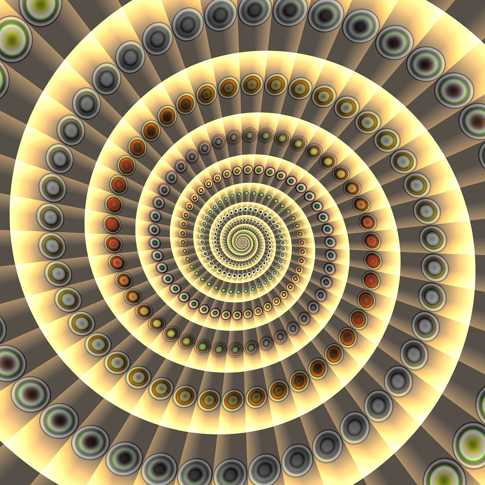

Visual Design and Web Project | Coding Sessions | Joseph Muller

[Previous](working-with-strings.md) | [All](README.md) | [Next](objects.md)

# Using loops

*"Spiral with buttons" by parameter_bond is marked with Public Domain Mark 1.0. To view the terms, visit [https://creativecommons.org/publicdomain/mark/1.0/?ref=openverse](https://creativecommons.org/publicdomain/mark/1.0/?ref=openverse).*

With arrays and the array-like qualities of strings in your wheelhouse, you are ready to roll on to iteration, one of the most powerful patterns in programming.

JavaScript provides several different types of loops, each useful for different purposes.

## Looping over an array

If you have an array and want to perform something with each of the item in the array, it is best to use a `for...of` loop.

https://github.com/Birkbeck2/vdwp2223/blob/6b85fd3cbe4876058dae9ec57417273de5fe5ec0/loops.js#L1-L20

Whatever variable you declare in the parentheses will be bound to each item in the array in turn, so that you can refer to it inside the brackets.

This variable is just available inside the bracket block, because it has block scope.

https://github.com/Birkbeck2/vdwp2223/blob/6b85fd3cbe4876058dae9ec57417273de5fe5ec0/loops.js#L23-L24

## Looping over a string

You can loop over a string in the same way. JavaScript will break it up and pass each character as the variable.

https://github.com/Birkbeck2/vdwp2223/blob/6b85fd3cbe4876058dae9ec57417273de5fe5ec0/loops.js#L27-L33

## Old-school loops

Early JavaScript provided a different way to write loops, and the syntax is a bit more complicated. But it is still useful if you want to structure the loop based on a counter.

For example, say instead of looping over all the songs in `songs`, you wanted just the first three, and you needed to know their order in the list.

https://github.com/Birkbeck2/vdwp2223/blob/6b85fd3cbe4876058dae9ec57417273de5fe5ec0/loops.js#L36-L44

The parentheses contain three statements, each of which does something specific:

  1. Declare the variable to use as counter
  2. Declare the condition that, when `true`, continues the loop, and when `false`, ends the loop
  3. Declare how the counter should change after the first iteration and between each subsequent iteration

So in this loop, we are saying: "Start the counter at `0`, stop the loop before it reaches `3`, and after each loop, increment it by `1`."

The counter variable name is arbitrary. By convention, the counter is usually assigned to the variable `i`, but it doesn't have to be.

## Building one array while looping over another

A common task in programs is to make one array based on conditions applied to another.

For example, say you wanted a list of all the words used in the song titles in `songs`, to feed them to a search engine. Duplicates are OK. Could you write a program to create such an array?

https://github.com/Birkbeck2/vdwp2223/blob/6b85fd3cbe4876058dae9ec57417273de5fe5ec0/loops.js#L47-L64

Challenges: What if you wanted no duplicates? What if you wanted no punctuation, only the 26 letters of the English alphabet? How about all lowercase?

## Check your understanding
What is logged to the console?

https://github.com/Birkbeck2/vdwp2223/blob/6b85fd3cbe4876058dae9ec57417273de5fe5ec0/loops.js#L67-L71

How many horses are there?

https://github.com/Birkbeck2/vdwp2223/blob/6b85fd3cbe4876058dae9ec57417273de5fe5ec0/loops.js#L74-L78

## References

Marijn Haverbeke, *Eloquent JavaScript: A Modern Introduction to Programming* (EJS), third edition, 2018, [https://eloquentjavascript.net/](https://eloquentjavascript.net/)

## Rights

Copyright Birkbeck, University of London

 This work is licensed under a <a rel="license" href="http://creativecommons.org/licenses/by/4.0/">Creative Commons Attribution 4.0 International License</a>.
