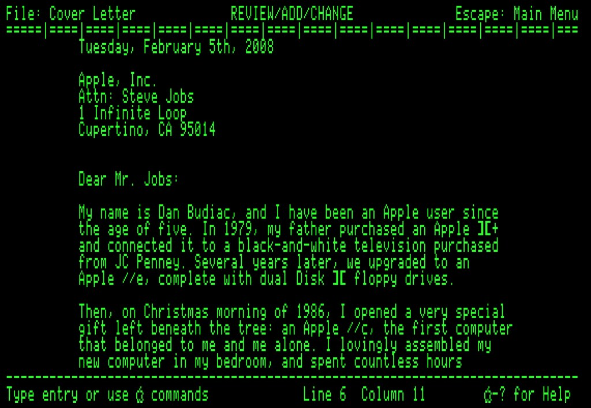

Visual Design and Web Project | Coding Sessions | Joseph Muller

[Previous](forming-data-sets-with-arrays.md) | [All](README.md) | [Next](loops.md)

# Working with strings

*"Letter" by dansays is licensed under CC BY-NC-SA 2.0. To view a copy of this license, visit [https://creativecommons.org/licenses/by-nc-sa/2.0/?ref=openverse](https://creativecommons.org/licenses/by-nc-sa/2.0/?ref=openverse).*

Arrays and strings share an odd affinity, more than you would think. At base, a string is a sequence of characters. Like items in an array, the characters can be counted, their order can be remembered, subsets of them can be made.

Because of this, some of the patterns for programming with strings resemble array methods.

## Indexing and slicing

For one, you can access characters and substrings with the same indexing syntax as with arrays.

https://github.com/Birkbeck2/vdwp2223/blob/6b85fd3cbe4876058dae9ec57417273de5fe5ec0/working-with-strings.js#L1-L6

The same goes for the `slice` method:

https://github.com/Birkbeck2/vdwp2223/blob/6b85fd3cbe4876058dae9ec57417273de5fe5ec0/working-with-strings.js#L9-L12

## Measuring

How long is a piece of string? Ask the `length` property.

https://github.com/Birkbeck2/vdwp2223/blob/6b85fd3cbe4876058dae9ec57417273de5fe5ec0/working-with-strings.js#L15-L16

## Marking new lines

You can tell JavaScript to insert a line break with the special character `\n`, or newline. The backslash escapes the `n` so it's not treated like other `n`s.

Code editors will often higlight special characters inside strings to show you they are different, but newline characters are still part of the string.

https://github.com/Birkbeck2/vdwp2223/blob/6b85fd3cbe4876058dae9ec57417273de5fe5ec0/working-with-strings.js#L19-L22

## Trimming

You can remove whitespace (spaces, tabs, newlines) from the beginning and end of a string with the `trim` method.

https://github.com/Birkbeck2/vdwp2223/blob/6b85fd3cbe4876058dae9ec57417273de5fe5ec0/working-with-strings.js#L25-L31

## Putting one string inside another

You can *interpolate* one string inside another by using a special syntax for *template strings*.

https://github.com/Birkbeck2/vdwp2223/blob/6b85fd3cbe4876058dae9ec57417273de5fe5ec0/working-with-strings.js#L34-L41

The syntax involves backticks rather than quotes around the string, as well as a dollar sign and curly brackets inside the template, around the placeholder variable.

## Making arrays from strings

You can turn strings into arrays and vice versa with the `split` and `join` methods.

`split` breaks apart a string on whatever character you give it.

You can split on spaces:

https://github.com/Birkbeck2/vdwp2223/blob/6b85fd3cbe4876058dae9ec57417273de5fe5ec0/working-with-strings.js#L44-L52

Or on any sequence of characters in the string:

https://github.com/Birkbeck2/vdwp2223/blob/6b85fd3cbe4876058dae9ec57417273de5fe5ec0/working-with-strings.js#L55-L61

If you try to split on something that isn't in the string, you get the whole string put into a one-item array:

https://github.com/Birkbeck2/vdwp2223/blob/6b85fd3cbe4876058dae9ec57417273de5fe5ec0/working-with-strings.js#L64-L66

## Making strings from arrays

With `join` you can go from array to string. You just tell the method what character to put as the glue between all the pieces of the array.

https://github.com/Birkbeck2/vdwp2223/blob/6b85fd3cbe4876058dae9ec57417273de5fe5ec0/working-with-strings.js#L69-L76

If something in the array is not a string, JavaScript converts its type to string before joining it with the other strings.

## Check your understanding

What will be logged to the console?

https://github.com/Birkbeck2/vdwp2223/blob/6b85fd3cbe4876058dae9ec57417273de5fe5ec0/working-with-strings.js#L79-L84

## References

Marijn Haverbeke, *Eloquent JavaScript: A Modern Introduction to Programming* (EJS), third edition, 2018, [https://eloquentjavascript.net/](https://eloquentjavascript.net/)

## Rights

Copyright Birkbeck, University of London

 This work is licensed under a <a rel="license" href="http://creativecommons.org/licenses/by/4.0/">Creative Commons Attribution 4.0 International License</a>.
